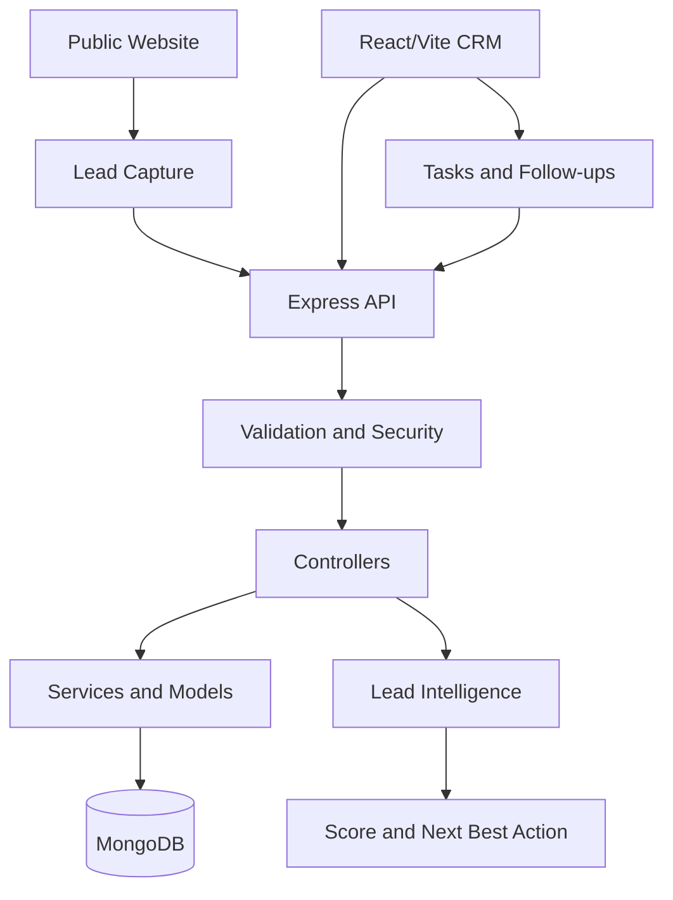
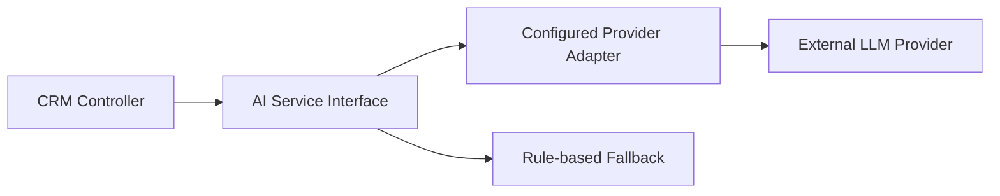
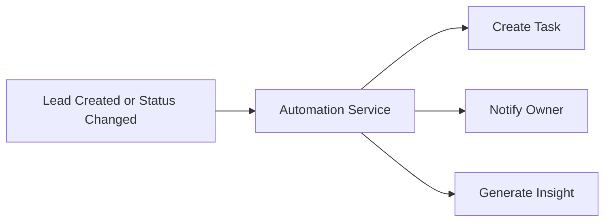

# LeadFlow CRM

> **Capture. Understand. Engage. Convert.**

LeadFlow CRM is a multi-tenant lead management foundation for agencies, freelancers, consultants, startups, and small teams. It combines public lead capture, secure workspaces, explainable lead intelligence, task follow-ups, and organization-scoped CRM APIs.

## Project Overview

LeadFlow turns an inquiry into an actionable sales workflow: capture the lead, detect duplicates, score intent transparently, assign work, schedule follow-ups, and keep the team focused on the next best action.

## Problem and Solution

Small teams lose opportunities across forms, spreadsheets, inboxes, and reminders. LeadFlow centralizes those workflows in a secure workspace with a public capture surface, authenticated CRM dashboard, task queue, and explainable scoring service.

## Key Features

- Public contact and lead capture
- Create-account and JWT cookie sign-in
- Organization/workspace foundation
- RBAC roles: owner, admin, manager, sales agent, viewer
- Organization-scoped lead access
- Duplicate detection by email and phone
- Search, filters, pagination, and lead stats
- Explainable lead score from 0 to 100
- Hot, warm, and cold temperature classification
- Next-best-action recommendations
- Tasks and follow-up views: overdue, today, tomorrow, upcoming
- Responsive light/dark CRM interface
- MongoDB health monitoring

## AI and Intelligence

The current intelligence layer is deliberately transparent and rule-based. It never presents a heuristic as a guaranteed prediction. The service is isolated so provider-backed AI can be added later through `AI_PROVIDER` and `AI_API_KEY` without coupling controllers to an LLM vendor.

Current intelligence endpoints:

- `GET /api/leads/:id/score`
- `GET /api/leads/:id/insights`

## CRM and Automation Roadmap

LeadFlow is structured for future contacts, companies, opportunities, notifications, automations, audit logs, reports, and AI copilot workflows. Task completion and lead status mutations are already persisted API operations; future automation triggers can subscribe to those service boundaries.

## Analytics

The API currently provides organization-scoped status statistics and lead intelligence. The next analytics layer will add source attribution, conversion funnels, response SLA metrics, pipeline value, forecasting, and team performance.

## Security

- JWT authentication in an httpOnly cookie
- bcrypt password hashing
- Helmet secure headers
- CORS origin allowlist
- API and login rate limiting
- Zod input validation
- Mongo ObjectId validation
- Organization isolation on protected CRM records
- Granular route permissions
- Secrets excluded from git

## Architecture



The active request path is:

```text
React/Vite -> Axios -> Express middleware -> controller -> service/model -> MongoDB
```

## Tech Stack

- React 18
- Vite
- React Router
- Axios
- Tailwind CSS
- Lucide React and Recharts-ready frontend dependencies
- Node.js
- Express
- TypeScript
- Mongoose
- MongoDB / MongoDB Atlas
- JWT and bcryptjs

## Folder Structure

```text
leadflow-crm/
├── client/
│   ├── src/
│   ├── public/
│   ├── package.json
│   └── README.md
├── server/
│   ├── config/
│   ├── controllers/
│   ├── middleware/
│   ├── models/
│   ├── routes/
│   ├── services/
│   ├── lib/
│   ├── package.json
│   └── README.md
├── .env.example
├── .gitignore
├── LICENSE
└── README.md
```

Earlier Next.js/Prisma files remain in the repository as preserved history. The active product is `client/` plus the MongoDB-backed `server/` API.

## Screenshots

Add product screenshots to `docs/screenshots/` and reference them here as the UI stabilizes.

## Installation

```bash
git clone https://github.com/Aditijindal25/Leadflow-crm.git
cd Leadflow-crm
cd server && npm install
cd ../client && npm install
```

## Environment Variables

Create `server/.env` from `server/.env.example` and `client/.env` from `client/.env.example`.

```env
# server/.env
PORT=5000
MONGODB_URI=mongodb://127.0.0.1:27017/leadflow
JWT_SECRET=use-a-long-random-secret
CLIENT_URL=http://localhost:3002
NODE_ENV=development
DEFAULT_ORGANIZATION_ID=
AI_API_KEY=
AI_PROVIDER=

# client/.env
VITE_API_URL=http://localhost:5000/api
```

Never commit real environment files, database credentials, JWT secrets, or provider keys.

## MongoDB Setup

Use a local MongoDB service or MongoDB Atlas. For local development:

```env
MONGODB_URI=mongodb://127.0.0.1:27017/leadflow
```

Seed the development workspace and owner:

```bash
cd server
npm run seed:mongo
```

Copy the printed workspace ID into `DEFAULT_ORGANIZATION_ID`, then restart the API.

## Running Locally

Terminal 1:

```bash
cd server
npm run dev
```

Terminal 2:

```bash
cd client
npm run dev
```

Open `http://localhost:3002`.

## API Documentation

### Health

- `GET /api/health`

### Authentication

- `POST /api/auth/register`
- `POST /api/auth/login`
- `POST /api/auth/logout`
- `GET /api/auth/me`

### Leads

- `GET /api/leads?page=1&limit=20&search=...`
- `POST /api/leads`
- `GET /api/leads/:id`
- `PATCH /api/leads/:id`
- `DELETE /api/leads/:id`
- `GET /api/leads/stats`
- `GET /api/leads/:id/score`
- `GET /api/leads/:id/insights`
- `POST /api/leads/:id/interactions`

### Tasks and Follow-ups

- `GET /api/tasks?view=overdue|today|tomorrow|upcoming`
- `POST /api/tasks`
- `PATCH /api/tasks/:id`
- `DELETE /api/tasks/:id`

Responses use:

```json
{ "success": true, "data": {} }
```

Errors use:

```json
{ "success": false, "message": "Human readable message", "code": "ERROR_CODE" }
```

## Authentication and RBAC

Authentication uses an httpOnly JWT cookie. Protected requests require a valid token and organization claim. Roles and permissions are enforced in backend middleware, not only in frontend routing.

- Owner and admin: full workspace management
- Manager: team-level lead, task, and analytics access
- Sales agent: operational lead and task access
- Viewer: read-only lead, task, and analytics access

## AI Architecture

AI capabilities are provider-agnostic by design:



No AI provider is required for the current product to function.

## Automation Architecture

Task and status service boundaries are designed for future trigger/action execution:



External communication is not faked; provider abstractions should be connected before sending real messages.

## Testing and Build Checks

```bash
cd client && npm run build
cd ../server && npm run build
```

The current verification baseline includes frontend production compilation, backend TypeScript compilation, MongoDB health, authentication, lead creation, organization scoping, and task route compilation.

## Deployment

### Frontend: Vercel

- Root directory: `client`
- Build command: `npm run build`
- Output directory: `dist`
- Variable: `VITE_API_URL=https://your-api.example.com/api`

### Backend: Render or Railway

- Root directory: `server`
- Build command: `npm install && npm run build`
- Start command: `npm start`
- Variables: `PORT`, `MONGODB_URI`, `JWT_SECRET`, `CLIENT_URL`, `NODE_ENV`

### Database: MongoDB Atlas

- Create a database user
- Add the deployment IP/network access rule
- Use the Atlas connection string as `MONGODB_URI`
- Set `CLIENT_URL` to the deployed frontend origin

## Future Roadmap

- Lead 360 profile and pipeline Kanban
- Contacts, companies, and opportunities
- Notifications and audit logs
- Automation execution history
- CSV import/export
- Analytics and revenue forecasting
- AI summaries, reply drafts, and call preparation
- Team management and saved views
- PWA and command center

## Contributors

LeadFlow CRM is maintained by Aditi Jindal. Contributions should preserve organization isolation, backend authorization, validation, and the active Vite/Mongoose architecture.

## License

MIT. See [LICENSE](LICENSE).
